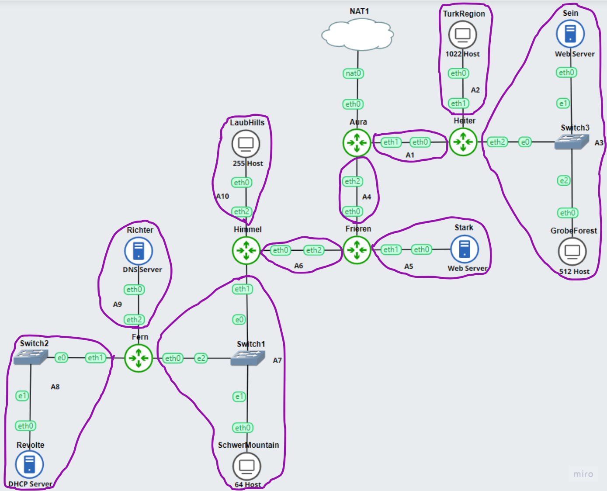
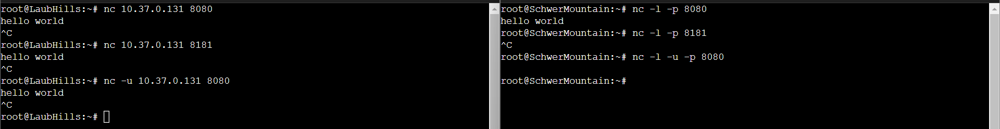
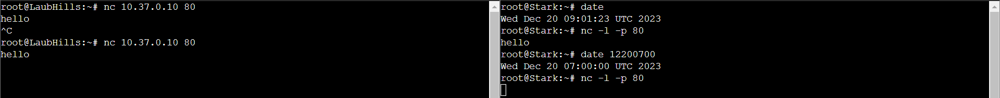

# Jarkom-Modul-5-E01-2023

## VLSM

### Subnet



Perhitungan total ip yang dibutuhkan dapat dilihat pada [Sheet_E01_M5](https://docs.google.com/spreadsheets/d/1mIgHDxm8U_EyWfi1Ubm0kJ7n5WhfInF_esE9jOywejs/edit?usp=sharing)

### Tree

Dari Subnet terbesar yang didapatkan sebelumnya, maka tree akan dimulai dari /20


### IP

Berikut adalah hasil pembagian IP tiap subnet berdasarkan tree yang telah dibuat


_sumber: [Sheet_E01_M5](https://docs.google.com/spreadsheets/d/1mIgHDxm8U_EyWfi1Ubm0kJ7n5WhfInF_esE9jOywejs/edit?usp=sharing)_

## Persiapan

Beberapa instalasi dan konfigurasi yang diperlukan sebelum pengerjaan soal:

### Network Config
* Aura
```bash
auto eth0
iface eth0 inet dhcp

#A1
auto eth1
iface eth1 inet static
	address 10.37.0.1
	netmask 255.255.255.252

#A4
auto eth2
iface eth2 inet static
	address 10.37.0.5
	netmask 255.255.255.252
```
<br>

* Heiter
```bash
#A1
auto eth0
iface eth0 inet static
	address 10.37.0.2
	netmask 255.255.255.252
	gateway 10.37.0.1

#A2
auto eth1
iface eth1 inet static
	address 10.37.8.1
	netmask 255.255.248.0

#A3
auto eth2
iface eth2 inet static
	address 10.37.4.1
	netmask 255.255.252.0

up echo "nameserver 192.168.122.1" > /etc/resolv.conf
```
<br>

* Frieren
```bash
#A4
auto eth0
iface eth0 inet static
	address 10.37.0.6
	netmask 255.255.255.252
	gateway 10.37.0.5

#A5
auto eth1
iface eth1 inet static
	address 10.37.0.9
	netmask 255.255.255.252

#A6
auto eth2
iface eth2 inet static
	address 10.37.0.13
	netmask 255.255.255.252

up echo "nameserver 192.168.122.1" > /etc/resolv.conf
```
<br>

* Himmel
```bash
#A6
auto eth0
iface eth0 inet static
	address 10.37.0.14
	netmask 255.255.255.252
	gateway 10.37.0.13

#A7
auto eth1
iface eth1 inet static
	address 10.37.0.129
	netmask 255.255.255.128

#A10
auto eth2
iface eth2 inet static
	address 10.37.2.1
	netmask 255.255.254.0

up echo "nameserver 192.168.122.1" > /etc/resolv.conf
```
<br>

* Fern
```bash
#A7
auto eth0
iface eth0 inet static
	address 10.37.0.130
	netmask 255.255.255.128
	gateway 10.37.0.129

#A8
auto eth1
iface eth1 inet static
	address 10.37.0.17
	netmask 255.255.255.252

#A9
auto eth2
iface eth2 inet static
	address 10.37.0.21
	netmask 255.255.255.252

up echo "nameserver 192.168.122.1" > /etc/resolv.conf
```
<br>

* Revolte
```bash
#A8
auto eth0
iface eth0 inet static
	address 10.37.0.18
	netmask 255.255.255.252
	gateway 10.37.0.17

up echo "nameserver 192.168.122.1" > /etc/resolv.conf
```
<br>

* Richter
```bash
auto eth0
iface eth0 inet dhcp
hwaddress ether e6:f7:42:33:c8:7b
```
<br>

* Stark
```bash
auto eth0
iface eth0 inet dhcp
hwaddress ether da:99:8b:0f:1c:54
```
<br>

* Sein
```bash
auto eth0
iface eth0 inet dhcp
hwaddress ether 56:08:50:c9:cd:0e
```
<br>

* TurkRegion, GrobeForest, SchwerMountain, LaubHills
```bash
auto eth0
iface eth0 inet dhcp
```

### **Routing**
* Aura
```bash
#A2
route add -net 10.37.8.0 netmask 255.255.248.0 gw 10.37.0.2
#A3
route add -net 10.37.4.0 netmask 255.255.252.0 gw 10.37.0.2
#A5
route add -net 10.37.0.8 netmask 255.255.255.252 gw 10.37.0.6
#A6
route add -net 10.37.0.12 netmask 255.255.255.252 gw 10.37.0.6
#A7
route add -net 10.37.0.128 netmask 255.255.255.128 gw 10.37.0.6
#A8
route add -net 10.37.0.16 netmask 255.255.255.252 gw 10.37.0.6
#A9
route add -net 10.37.0.20 netmask 255.255.255.252 gw 10.37.0.6
#A10
route add -net 10.37.2.0 netmask 255.255.254.0 gw 10.37.0.6
```
<br>

* Frieren
```bash
#A7
route add -net 10.37.0.128 netmask 255.255.255.128 gw 10.37.0.14
#A8
route add -net 10.37.0.16 netmask 255.255.255.252 gw 10.37.0.14
#A9
route add -net 10.37.0.20 netmask 255.255.255.252 gw 10.37.0.14
#A10
route add -net 10.37.2.0 netmask 255.255.254.0 gw 10.37.0.14
```
<br>

* Himmel
```bash
#A8
route add -net 10.37.0.16 netmask 255.255.255.252 gw 10.37.0.130
#A9
route add -net 10.37.0.20 netmask 255.255.255.252 gw 10.37.0.130
```
### **DHCP Server (Revolte)**

Pertama, lakukan instalasi package yang diperlukan
```bash
apt-get update
apt-get install isc-dhcp-server netcat -y
```
<br>

Kemudian, tambahkan konfigurasi interface untuk IPv4
* _/etc/default/isc-dhcp-server_
```bash
INTERFACESv4="eth0"
INTERFACESv6=""
```
<br>

Setelah itu, atur pembagian IP berdasarkan hasil dari VLSM yang telah dilakukan
* _/etc/dhcp/dhcpd.conf_
```bash
#A1
subnet 10.37.0.0 netmask 255.255.255.252 {
}

#A2
subnet 10.37.8.0 netmask 255.255.248.0 {
    range 10.37.8.2 10.37.15.254;
    option routers 10.37.8.1;
    option broadcast-address 10.37.15.255;
    option domain-name-servers 10.37.0.22;
    default-lease-time 300;
    max-lease-time 5760;
}

#A3
subnet 10.37.4.0 netmask 255.255.252.0 {
    range 10.37.4.2 10.37.7.254;
    option routers 10.37.4.1;
    option broadcast-address 10.37.7.255;
    option domain-name-servers 10.37.0.22;
    default-lease-time 300;
    max-lease-time 5760;
}

host Sein {
    hardware ethernet 56:08:50:c9:cd:0e;
    fixed-address 10.37.4.2;
}

#A4
subnet 10.37.0.4 netmask 255.255.255.252 {
}

#A5
subnet 10.37.0.8 netmask 255.255.255.252 {
    range 10.37.0.10 10.37.0.10;
    option routers 10.37.0.9;
    option broadcast-address 10.37.0.11;
    option domain-name-servers 10.37.0.22;
    default-lease-time 300;
    max-lease-time 5760;
}

host Stark {
    hardware ethernet da:99:8b:0f:1c:54;
    fixed-address 10.37.0.10;
}

#A6
subnet 10.37.0.12 netmask 255.255.255.252 {
}

#A7
subnet 10.37.0.128 netmask 255.255.255.128 {
    range 10.37.0.130 10.37.0.254;
    option routers 10.37.0.129;
    option broadcast-address 10.37.0.255;
    option domain-name-servers 10.37.0.22;
    default-lease-time 300;
    max-lease-time 5760;
}

#A8
subnet 10.37.0.16 netmask 255.255.255.252 {
}

#A9
subnet 10.37.0.20 netmask 255.255.255.252 {
    range 10.37.0.22 10.37.0.22;
    option routers 10.37.0.21;
    option broadcast-address 10.37.0.23;
    option domain-name-servers 192.168.122.1;
    default-lease-time 300;
    max-lease-time 5760;
}

host Richter {
    hardware ethernet e6:f7:42:33:c8:7b;
    fixed-address 10.37.0.22;
}

#A10
subnet 10.37.2.0 netmask 255.255.254.0 {
    range 10.37.2.2 10.37.3.254;
    option routers 10.37.2.1;
    option broadcast-address 10.37.3.255;
    option domain-name-servers 10.37.0.22;
    default-lease-time 300;
    max-lease-time 5760;
}
```
<br>

Restart service dhcp untuk mengaktifkan konfigurasi yang sudah ditambahkan
```bash
service isc-dhcp-server restart
```

### **DHCP Relay (All Router)**

Pertama, install package yang diperlukan
```bash
apt-get update
DEBIAN_FRONTEND=noninteractive apt-get install -y --no-install-recommends isc-dhcp-relay
```
<br>

Start service dhcp-relay
```bash
service isc-dhcp-relay start
```
<br>

Tambahkan konfigurasi IP dhcp server dan interface yang digunakan
* _/etc/default/isc-dhcp-relay_
```bash
SERVERS=\"10.37.0.18\"
INTERFACES=\"eth1 eth2\"
OPTIONS=
```
<br>

Jangan lupa aktifkan ip forwarder
* _/etc/sysctl.conf_
```bash
net.ipv4.ip_forward=1
```
<br>

Restart service dhcp-relay untuk mengaktifkan konfigurasi yang telah ditambahkan

```bash
service isc-dhcp-relay restart
```

### **Client (LaubHills, SchwerMountain, GrobeForest, TurkRegion)**

Install package-package yang diperlukan untuk keperluan testing rule IPTABLES

```bash
apt-get update
apt-get install netcat nmap lynx -y
```

## No. 1

### ***Agar topologi yang kalian buat dapat mengakses keluar, kalian diminta untuk mengkonfigurasi Aura menggunakan iptables, tetapi tidak ingin menggunakan MASQUERADE.***

```bash
iptables -t nat -A POSTROUTING -o eth0 -j SNAT --to-source $ip
```
> $ip adalah IP dari port eth0 yang terhubung dengan node NAT
<br>

Testing

> Dapat dilihat pada Aura, source ip icmp request dan destination ip icmp reply menggunakan ip eth0 Aura bukan ip eth0 Heiter

## No. 2

### ***Kalian diminta untuk melakukan drop semua TCP dan UDP kecuali port 8080 pada TCP.***

```bash
iptables -A INPUT -p tcp --dport 8080 -j ACCEPT

iptables -A INPUT -p tcp -j DROP
iptables -A INPUT -p udp -j DROP
```
<br>

Testing

> nc pertama adalah percobaan tcp port 8080, "hello world" muncul pada scwermountain<br><br>
> nc kedua adalah percobaan tcp port selain 8080, pesan tidak terkirim<br><br>
> nc ketiga adalah percobaan udp, pesan tidak terkirim 

## No. 3

### ***Kepala Suku North Area meminta kalian untuk membatasi DHCP dan DNS Server hanya dapat dilakukan ping oleh maksimal 3 device secara bersamaan, selebihnya akan di drop.***

```bash
iptables -A INPUT -p icmp -m connlimit --connlimit-above 3 --conlimit-mask 0 -j DROP
```
<br>

Testing

> Ketika 4 client ping secara bersamaan (menggunakan broadcast input) menuju host, hanya GrobeForest yang mengalami 100% packet loss

## No. 4

### ***Lakukan pembatasan sehingga koneksi SSH pada Web Server hanya dapat dilakukan oleh masyarakat yang berada pada GrobeForest.***

```bash
iptables -A INPUT -p tcp --dport 22 -s 10.37.4.0/22 -j ACCEPT

iptables -A INPUT -p tcp --dport 22 -j DROP
```
<br>

Testing

> Hanya pesan dari GrobeForest yang terkirim, pesan dari LaubHills tidak terkirim

## No. 5

### ***Selain itu, akses menuju WebServer hanya diperbolehkan saat jam kerja yaitu Senin-Jumat pada pukul 08.00-16.00.***

```bash
iptables -A INPUT -p tcp --dport 80 -m time --days Mon,Tue,Wed,Thu,Fri --timestart 08:00 --timestop 16:00 -j ACCEPT

iptables -A INPUT -p tcp --dport 80 -j DROP
```
<br>

Testing

> nc pertama pada hari rabu pukul 9, pesan terkirim<br><br>
> nc kedua pada hari rabu pukul 7, pesan tidak terkirim

## No. 6

### ***Lalu, karena ternyata terdapat beberapa waktu di mana network administrator dari WebServer tidak bisa stand by, sehingga perlu ditambahkan rule bahwa akses pada hari Senin - Kamis pada jam 12.00 - 13.00 dilarang (istirahat maksi cuy) dan akses di hari Jumat pada jam 11.00 - 13.00 juga dilarang (maklum, Jumatan rek).***

```bash
iptables -I INPUT 1 -p tcp --dport 80 -m time --days Mon,Tue,Wed,Thu --timestart 12:00 --timestop 13:00 -j DROP

iptables -I INPUT 2 -p tcp --dport 80 -m time --days Fri --timestart 11:00 --timestop 13:00 -j DROP
```
<br>

Testing

> nc pertama pada hari rabu pukul 9, pesan terkirim<br><br>
> nc kedua pada hari rabu pukul 12.30, pesan tidak terkirim<br><br>
> nc ketiga pada hari jumat pukul 9, pesan terkirim<br><br>
> nc keempat pada hari jumat pukul 12, pesan tidak terkirim 

## No. 7

### ***Karena terdapat 2 WebServer, kalian diminta agar setiap client yang mengakses Sein dengan Port 80 akan didistribusikan secara bergantian pada Sein dan Stark secara berurutan dan request dari client yang mengakses Stark dengan port 443 akan didistribusikan secara bergantian pada Sein dan Stark secara berurutan.***

```bash
iptables -A PREROUTING -t nat -p tcp --dport 80 -d 10.37.4.2 -m statistic --mode nth --every 2 --packet 0 -j DNAT --to-destination 10.37.4.2

iptables -A PREROUTING -t nat -p tcp --dport 80 -d 10.37.4.2 -j DNAT --to-destination 10.37.0.10

iptables -A PREROUTING -t nat -p tcp --dport 443 -d 10.37.0.10 -m statistic --mode nth --every 2 --packet 0 -j DNAT --to-destination 10.37.0.10

iptables -A PREROUTING -t nat -p tcp --dport 443 -d 10.37.0.10 -j DNAT --to-destination 10.37.4.2
```
<br>

Testing


## No. 8

### ***Karena berbeda koalisi politik, maka subnet dengan masyarakat yang berada pada Revolte dilarang keras mengakses WebServer hingga masa pencoblosan pemilu kepala suku 2024 berakhir. Masa pemilu (hingga pemungutan dan penghitungan suara selesai) kepala suku bersamaan dengan masa pemilu Presiden dan Wakil Presiden Indonesia 2024.***

```bash
iptables -I INPUT 1 -m time --datestart "2024-02-14T00:00" --datestop "2024-03-20T23:59" -j DROP
```
<br>

Testing

> nc pertama pada 01-03-2024 09:00, pesan tidak terkirim<br><br>
> nc kedua pada 21-03-2024 09:00, pesan terkirim

## No. 9

### ***Sadar akan adanya potensial saling serang antar kubu politik, maka WebServer harus dapat secara otomatis memblokir  alamat IP yang melakukan scanning port dalam jumlah banyak (maksimal 20 scan port) di dalam selang waktu 10 menit.<br>(clue: test dengan nmap)***

```bash
iptables -N e01

iptables -A INPUT -m recent --name e01 --update --seconds 600 --hitcount 20 -j DROP

iptables -A FORWARD -m recent --name e01 --update --seconds 600 --hitcount 20 -j DROP

iptables -A INPUT -m recent --name e01 --set -j ACCEPT

iptables -A FORWARD -m recent --name e01 --set -j ACCEPT
```
<br>

Testing


## No. 10

### ***Karena kepala suku ingin tau paket apa saja yang di-drop, maka di setiap node server dan router ditambahkan logging paket yang di-drop dengan standard syslog level.***

```bash
iptables -I INPUT 1 -j LOG --log-prefix "DROP: "
```
<br>

Testing
